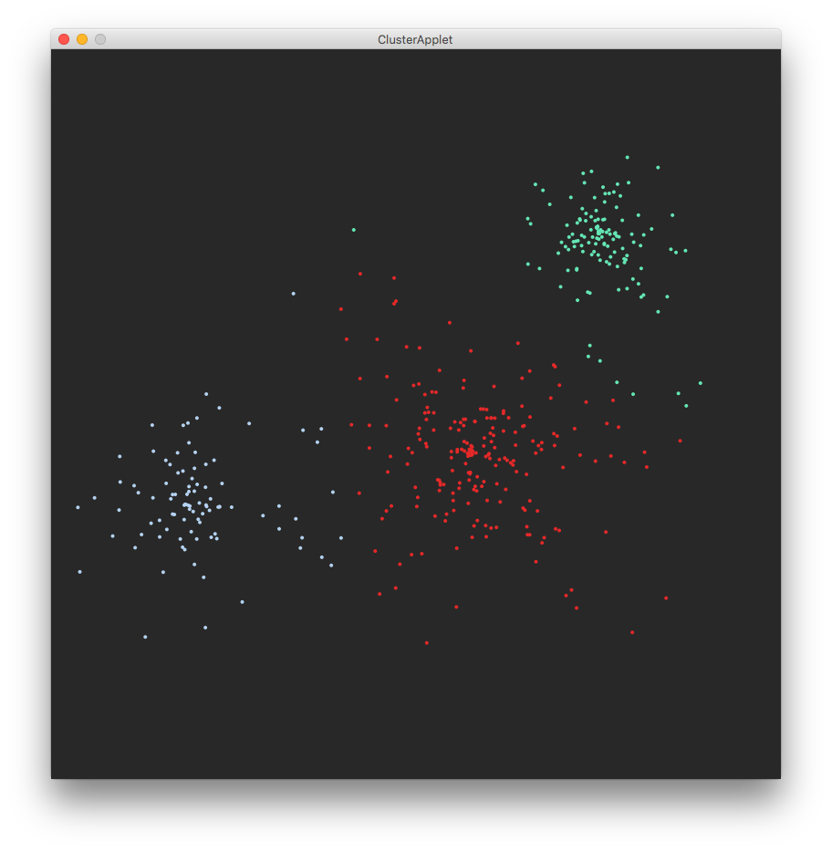

Apache Commonsで、平面上の点をクラスタリング。  
今回、クラスタリングされる点は、
仮として3つの中心点からノイズを加えて生成した。
それら多数の点を、3つのグループへクラスタリングする。

クラスタリング法は、基本的なK平均法を少し改良したK平均++法というのを使った。
今回は、元々3グループだったものを
計算で再度3グループにまとめるので、
自然にきれいにまとまる。  
今回は2次元上の点だが、それ以上の次元でもよい。  
点どうしの距離の測定法も、マンハッタン距離など、普通でないものを選べる。

Apache Commonsのクラスタリングには、DBSCANというものもある。
こちらは同心円の境界をきれいに分離できたり、
K平均ではできないような特徴があって面白い。

SBTとProcessingを併用した。

## 参考
- [Apache Commons公式](https://commons.apache.org/proper/commons-math/userguide/ml.html)
